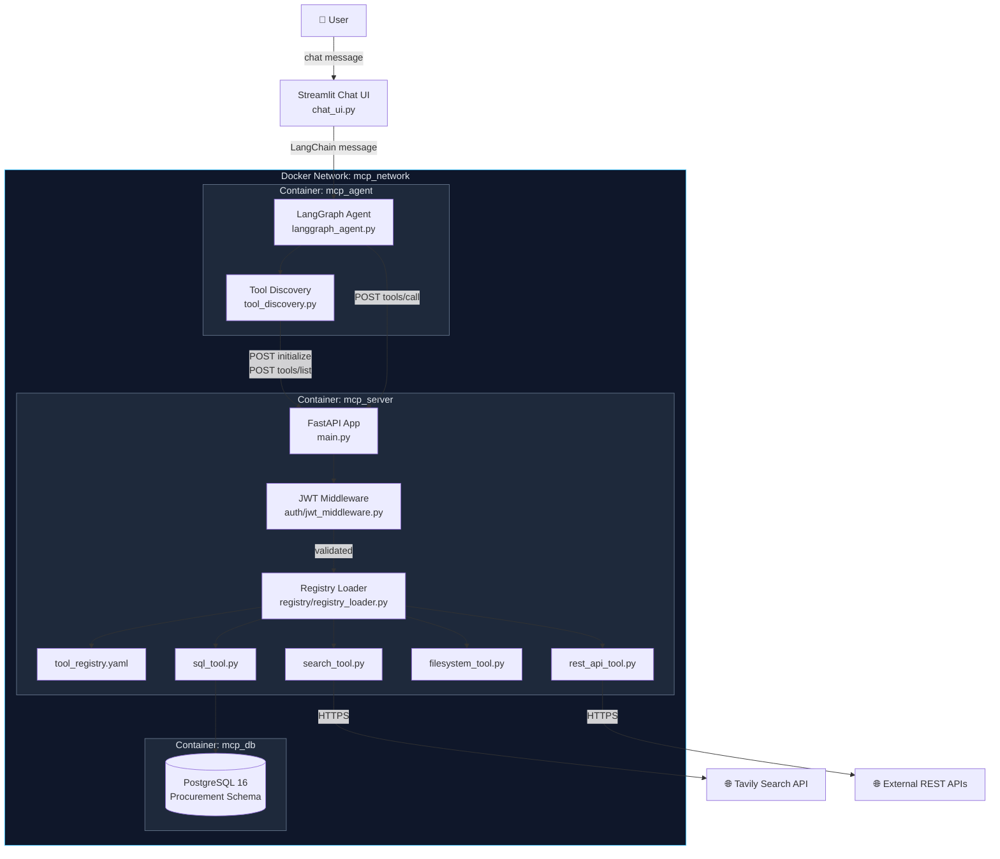
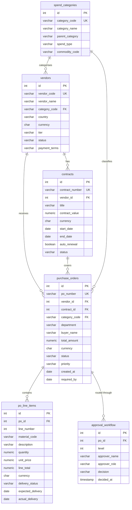

# Architecture

## System Diagram


## Procurement Database Schema


## Container Networking

All services run on the Docker bridge network `mcp_network`.

- **agent → mcp-server**: `http://mcp-server:8000` — Docker internal DNS resolves
  the service name declared in `docker-compose.yml` to the container IP
- **mcp-server → db**: `db:5432` — same DNS mechanism
- **mcp-server → external**: Tavily API and REST endpoints called over HTTPS,
  egress through the host's network stack
- No container is addressable by IP directly — always use service names

## MCP Request Flow
```
1.  User types message in Streamlit UI
2.  LangGraph agent receives message, enters ReAct loop
3.  On first run: agent sends initialize → notifications/initialized → tools/list
4.  Agent receives tool manifest (sql_query, web_search, filesystem_search, rest_api_search)
5.  LLM selects tool, agent sends tools/call with JSON arguments
6.  JWT middleware validates Bearer token — rejects if missing/expired
7.  Registry loader routes call to correct handler module
8.  Handler executes against real data source (PostgreSQL / Tavily / filesystem)
9.  Result returned as MCP JSON-RPC tools/call response
10. Agent incorporates result, continues ReAct loop or returns final answer
11. Streamlit UI renders final answer + full tool call trace panel
```